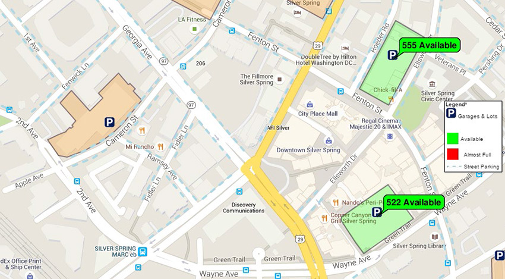
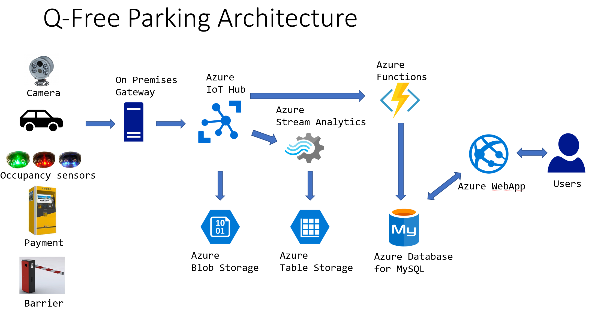
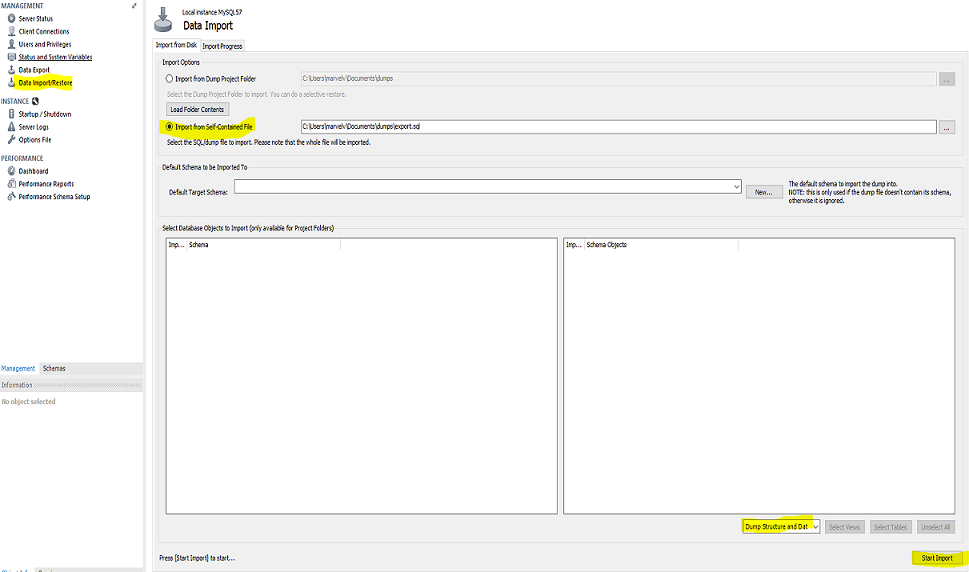
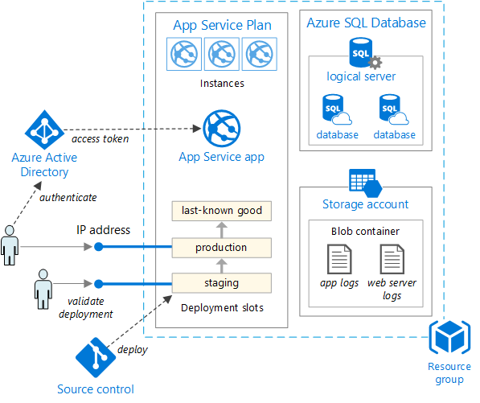
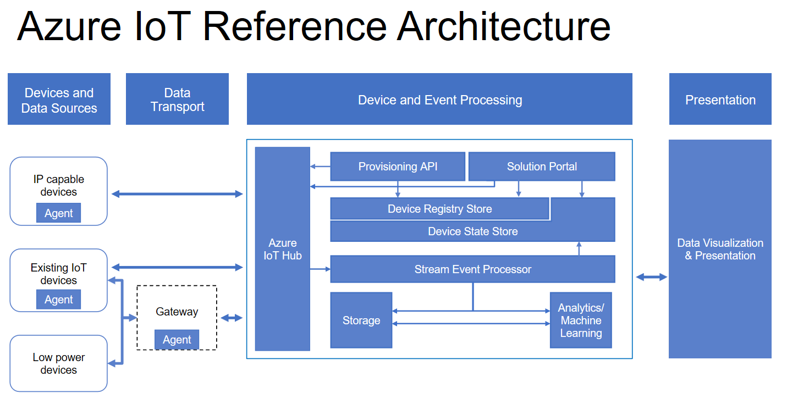
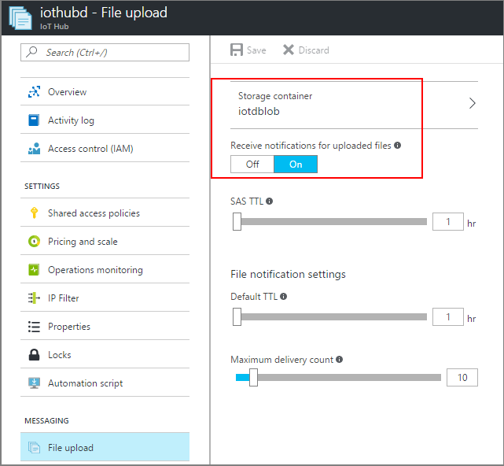
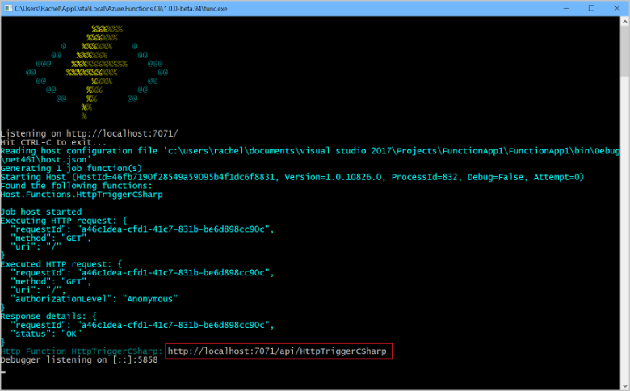
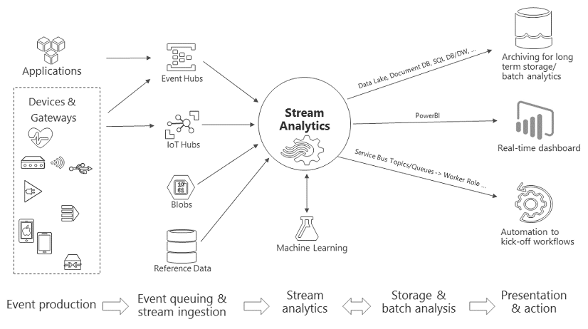
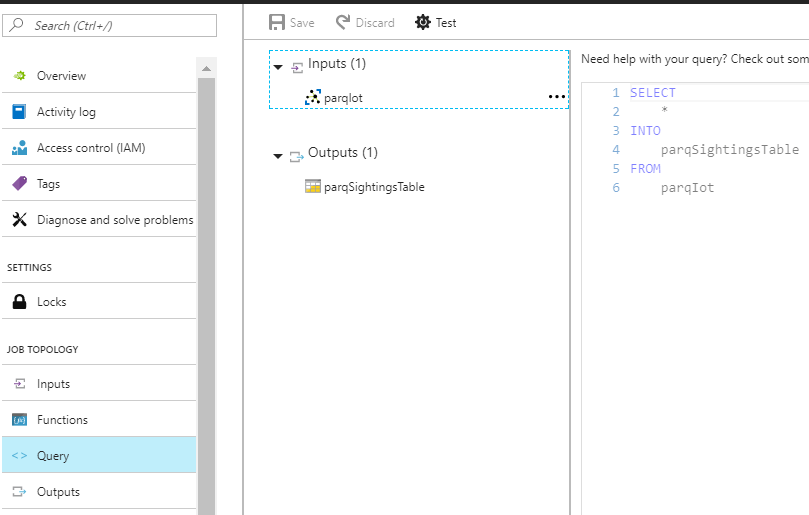

# Q-Free intelligent parking solutions with Azure Platform as a Service

Intelligent parking guidance and management systems are key parts of the infrastructure for smart and environmental friendly cities. A [study from INRIX](http://inrix.com/press-releases/parking-pain-us/) shows that Americans waste $73 billion per year in search for parking. Intelligent parking systems based on real-time occupancy sensors will be able to guide cars to available parking spaces in an optimal way. This will greatly reduce the time wasted in search for parking and will also reduce traffic congestions and emission.

To be able to support these scenarios Q-Free is now in the process of building their future parking systems on the Azure application platform. The system will be delivered as Software as a Service to their customers and will support ingest of real-time data (sensors and other sources) and provide intelligent parking guidance based on artificial intelligence and machine learning algorithms.

By leveraging Azure Platform as a Service with higher level building blocks, Q-Free will be able to focus development resources on delivering valuable features to their customers.

The first step on this journey is to migrate their existing on premises based parking management system to Azure Platform as a Service (PaaS). This report is a summary from a 4-day hackfest, where Q-Free and Microsoft worked together to test out how we could port their existing software to Azure PaaS.

*Q-Free Automatic License Plate Recognition*


### Solution overview

The existing solution is a traditional 3-tier web application written in PHP using MySQL as the database. There are also components / services written in .NET and C# to support the PC-based controllers deployed at each parking facility. These controllers receive data from various sensors, cameras, payment kiosk and will control the open / close of the barriers for entering and exiting the facility.

During the hackfest we migrated the whole solution to Azure leveraging a wide range of Platform as a Service components.

### Key technologies used

The following list is a nice explanation of how each is used: 

- The Web Apps feature of Azure App Service, for user portal and management of IoT devices.
- Azure Functions triggering on incoming data from the IoT Hub.
- Azure Functions for running back-end processing of data.
- Azure Database for MySQL. Storing all the relational data.
- Azure IoT Hub (device management / security, data ingest from device to cloud, cloud to device commands, secure file upload, device twins). With minimal modifications, we changed the existing C# code for the local PC-based controllers to connect to the Azure IoT Hub using the MQTT protocol.
- Azure Blob storage for storing uploaded files containing images of license plates for cars entering / exiting the facility.
- Azure Table Storage.
- Azure Stream Analytics for real-time message processing and storing data in Azure Table Storage.


### Hackfest members

The roles that took part in the hackfest were: 

| Company    | Role                         | Name |
| -------    | ----                         | ---- |
| Q-Free     | Development Manager          | Marvel Vella    |  
|            | Software Senior Developer    | Ayrton DeBattista         |
| Microsoft  | Technical Evangelist         | [Olav Tollefsen](https://www.linkedin.com/in/olavtollefsen/) |

 
## Customer profile ##

[Q-Free](http://www.q-free.com/) is a global supplier of Intelligent Transportation Systems (ITS).

The world around is rapidly changing. For Q-Free to continue to thrive as a technology leader and as a disruptor in many new areas for the next decades, we need to look ahead, understand the trends and markets that will shape the ITS business in the future and be prepared for what is to come. Q-Free aspires to be ready today for tomorrow and our vision reflects that. It creates a long-term aim for our business and provides us with a solid roadmap for our employees, partners and customers.

*Parking Guideance*


 
## Problem statement ##

The current solution is running on traditional Virtual Machines (VMs) in a datacenter.

When the load increases for the application there will be some effort to scale up the hardware resources accordingly. There is also a risk involved for situation where the load rapidly increases over the current limit for the provisioned hardware. When the load of the system is a lot less than the currently provisioned hardware capacity, there will be cost associated with overprovisioning of hardware.

A solution built on traditional VMs also needs processes for maintaining and updating the operating system and infrastructure. Typically, there will be downtime associated with some of these activities. In addition, the provisioning of new environments for test / development is also not automated and requires a lot of manual steps to deploy and configure.

Lastly there are also challenges with the current infrastructure to serve customers on a global scale.

## Solution and steps ##

The goal of the hackfest was to prove that the current solution could be migrated to run on various Azure PaaS components and to get an understand of the effort required.

These are the steps we performed:
- Create a target architecture for running the solution in Azure
- Migrate the on premises database to Azure Database for MySQL
- Migrate the PHP web application to Azure Web Apps
- Connect the PC gateway at the parking facilities to Azure IoT Hub
- Migrate existing code from running as Windows Services to run as Web Jobs or Azure Functions
- Migrate use of file share for images to Azure Blob Storage
- Test out Azure Table Storage for real-time IoT data

### Target architecture for migration to Azure

*Q-Free Parking Azure Architecture*



## Technical delivery ##

### Migrating the database to Azure Database for MySQL

Azure Database for MySQL provides a managed database service for app development and deployment that allows you to create a MySQL database in minutes and scale on the fly.

To migrate the on premises MySQL database to Azure Database for MySQL we used the MySQL Workbench tool. The database contained some minor tables, which used the MyISAM engine. These tables needs to be converted to the InnoDB engine prior to migrating them to Azure Database for MySQL. The effort required to convert from MyISAM to InnoDB for the Q-Free application was low.

With the database running on Azure Database for MySQL, Q-Free will no longer need resources to maintain database infrastructure.

*Migrate database to Azure Database for MySQL*



### Migrating the PHP web site to Azure Web App

The main web application is written in PHP using the MySQL database. To host the web application in Azure we use Azure Web Apps. Web Apps is a fully managed compute platform that is optimized for hosting websites and web applications. This platform-as-a-service (PaaS) offering of Microsoft Azure lets you focus on your business logic while Azure takes care of the infrastructure to run and scale your apps.

The process of migrating the PHP application to Azure Web Apps is quite straight forward. We created a Azure Web App and copied the web application files to Azure using FTP. Some tweaking of the PHP error_reporting setting was required to run the application successfully.

Here are some key features for Azure Web Apps:
- Multiple languages and frameworks - Web Apps has first-class support for ASP.NET, Node.js, Java, PHP, and Python. You can also run PowerShell and other scripts or executables on App Service VMs.
- DevOps optimization - Set up continuous integration and deployment with Visual Studio Team Services, GitHub, or BitBucket. Promote updates through test and staging environments. Perform A/B testing. Manage your apps in App Service by using Azure PowerShell or the cross-platform command-line interface (CLI).
- Global scale with high availability - Scale up or out manually or automatically. Host your apps anywhere in Microsoft's global datacenter infrastructure, and the App Service SLA promises high availability.
- Connections to SaaS platforms and on-premises data - Choose from more than 50 connectors for enterprise systems (such as SAP, Siebel, and Oracle), SaaS services (such as Salesforce and Office 365), and internet services (such as Facebook and Twitter). Access on-premises data using Hybrid Connections and Azure Virtual Networks.
- Security and compliance - App Service is ISO, SOC, and PCI compliant.
- Application templates - Choose from an extensive list of application templates in the Azure Marketplace that let you use a wizard to install popular open-source software such as WordPress, Joomla, and Drupal.
- Visual Studio integration - Dedicated tools in Visual Studio streamline the work of creating, deploying, and debugging.

*Reference Architecture for basic web application* 



### Connecting the parking facilities to Azure

At each parking facility, there is a PC-based controller, which is used to manage sensors, cameras, payment kiosks, barriers, signs and other hardware at the parking facility location.

The software running at the controller is written in C# on the .NET platform. The controllers have been communicating with the server-based parking solution using TCP/IP sockets.

With minimal changes to the controller code, we changed it to connect to the Azure IoT Hub using the MQTT protocol. Azure IoT Hub is a fully managed service that enables reliable and secure bidirectional communications between millions of IoT devices and a solution back end.

Data sent to Azure IoT Hub includes:
- Event data from various sensors at the parking facility
- Photos of license plates of cars entering / exiting the facility
- Automatic License Plate Recognition data

*Azure IoT Reference Architecture*



### IoT Device Security

An important part of any IoT scenario is security. The Azure IoT Suite secures devices while they are out in the field by providing a unique identity key for each device, which can be used by the IoT infrastructure to communicate with the device while it is in operation. The process is quick and easy to setup. The generated key with a user-selected device ID forms the basis of a token used in all communication between the device and the Azure IoT Hub.

Azure IoT Hub access control policies in the cloud enable activation and disabling any device identity, providing a way to disassociate a device from an IoT deployment when required. This association and disassociation of devices is based on each device identity.

### Secure upload of files

In addition, to sending ordinary device to cloud messages to the Azure IoT Hub we also have a need to upload larger chunks of data. At the parking facility there are cameras, which records images of the license plates of cars entering / exiting. These images will be uploaded to Azure Blob Storage. Normally the client would need some sort of key or access token to be able to upload files directly to Azure Blob Storage. This could have been a security challenge. We would not like to store a master key to the Azure Storage Account in the device client and we would have to implement some functionality for uploading files based on Shared Access Signatures. Azure IoT Hub does fortunately provides a good integration for simply doing this through the DeviceClient.UploadToBlobAsync method.

*Azure IoT HuB Secure File Upload*



*Upload a file to Azure Blob Storage trough the IoT Hub*

```c#
private static async void UploadToBlobAsync(string sourceFilePath, string targetFilename)
{
    Console.WriteLine($"Uploading file: {sourceFilePath}");
    var watch = System.Diagnostics.Stopwatch.StartNew();

    using (var sourceData = new FileStream(sourceFilePath, FileMode.Open))
    {
        await deviceClient.UploadToBlobAsync(targetFilename, sourceData);
    }

    watch.Stop();
    Console.WriteLine($"Upload of file to Blob completed. Time to upload file: {watch.ElapsedMilliseconds}ms\n");
}
```

## Serverless compute and Azure Functions

When migrating the Q-Free solution to Azure we needed to provide a computing environment for several back-end processing needs. In the on premises solution these compute tasks were typically running as Windows services running on the servers.

There are several options for hosting such services in Azure. Here are some of the choices:
- Virtual Machines
- Azure Web Jobs
- Azure Service Fabric
- Azure Functions

### Azure Functions for back-end processing


After considering pros and cons for the various options we chose to use Azure Functions for the back-end processing needs. Azure Functions is a serverless compute service that enables you to run code on-demand without having to explicitly provision or manage infrastructure. When using Azure Functions, one can fully focus on the business logic that needs to run in response to some event.

You can run Azure Functions in two different modes: Consumption plan and Azure App Service plan. The Azure Functions consumption plan automatically allocates compute power when your code is running, scales out as necessary to handle load, and then scales down when code is not running. So, you don't have to pay for idle VMs and don't have to reserve capacity in advance.

Migrating existing C# / .NET code to Azure Functions turned out to be really easy. The core business logic remains the same and one can simply remove all the plumbing that was required in the existing solution.

We used Azure Functions with different kind of events triggering the execution:
- Sensor data received from the IoT Hub (using the Event Hub trigger)
- Files are uploaded through the IoT Hub to Azure Blob Storage (Blob trigger)
- Time events for jobs needing to run on scheduled intervals
- Http requests for APIs

To create the Azure Functions we used the new Visual Studio 2017 tools for Azure Functions. These tools enable creating pre-compiled C# functions that bring better cold start performance than script based functions, and opens the entire eco-system of Visual Studio tools for class libraries including code analysis, unit testing, complete IntelliSense, 3rd party extensions, etc.

*Processing sensor data from Azure IoT Hub using Azure Function*

```c#
[FunctionName("ProcessSensorData")]
public static void Run(
    [EventHubTrigger("sensor-data", Connection = "IoTEventHub")]
    string sensorDataEventHubMessage, TraceWriter log)
{
    // Process the sensor data received

    log.Info($"C# Event Hub trigger function processed a message: {sensorDataEventHubMessage}");
}
```

*License plate image uploaded to Azure Blob Storage*


*Processing license plate images uploaded to Azure Blob Storage*

```c#
[FunctionName("ProcessLicensePlateImage")]
public static void Run(
    [BlobTrigger("license-plate-images/{name}", Connection = "LicensePlateBlobStorage")]
    Stream licensePlateBlob, string name, TraceWriter log)
{
    // Process license plate image

    log.Info($"C# Blob trigger function Processed blob\n Name:{name} \n Size: {licensePlateBlob.Length} Bytes");
}
```

Azure Functions Core (CLI) Tools lets you run Azure Functions project on your local development computer. You are prompted to install these tools the first time you start a function from Visual Studio. To start testing / debugging an Azure Function from Visual Studio, you simply press F5.

*Azure Functions local debug run-time output*



## Storing sensor data using Azure Stream Analytics

To store the incoming sensor data from the parking facilities we decided to explore the Azure Stream Analytics service.

The existing solution have been storing all kinds of data in the MySQL database. In the future, the solution must be able to handle much larger data volumes from an increasing number of sensors. The data will be used to create more intelligence embedded into the system. There will be needs to store historical data, perform advanced analytics and machine learning on the data and be able to perform real-time actions on incoming data. All these needs are taken care of by using Azure Stream Analytics in combination with other Azure services and custom code.

*Azure Stream Analytics. The big picture.*



Azure Stream Analytics is a fully managed event-processing engine that lets you set up real-time analytic computations on streaming data. The data can come from devices, sensors, web sites, social media feeds, applications, infrastructure systems, and more. 

We used Stream Analytics to store the data received by the Azure IoT Hub to a table in Azure Table Storage. This requires no custom code at all. Azure Stream Analytics offers a SQL-like query language for performing transformations and computations over streams of events.

*Use Stream Analytics to Store IoT data in Azure Table Storage*



## Conclusion ##

In just a few days we successfully migrated the end-to-end solution to Azure using many different Platform as a Service components with no virtual machines (except for hosting a development workstation).

We clearly saw how the Azure building blocks provides a rich set of out-of-the box functionality, which removes the need for writing a lot of custom code. The provisioning of resources can also be fully automated to support a very agile development / test environment. In addition the solution can be deployed to datacenter locations across the world to enable a true global distribution.

The serverless compute with Azure Functions have also dramatically reduced the complexity of hosting back-end processing tasks, with no need to manage compute hardware resources. The consumption plan of Azure Functions provides a true pay-as-you-go model, where you only pay for the compute resources used by the functions.

Most of the issues we encountered during the migration were caused by the need to update some of the tools and libraries in the development environment to newer versions. These issues were solved quickly and we managed to get all the major components of the solution up and running within the allocated time.

By moving new solution development to the Azure platform, Q-Free will realize several benefits:
- Freeing up developer time to focus effort on valuable new functionality for their customers.
- Reduce time to market by leveraging Azure high-level building blocks
- Being able to leverage advanced analytics and artificial intelligence services provided by the Azure platform
- Deliver their solutions on a global scale in a secure and reliable manner.

### Going Forward

Now, when we have seen how the existing solution can easily be migrated to Azure, the next step is to complete the migration work and put the solution into production.

In addition a new project has been started to architect a solution from scratch to support some new innovative solutions based on a newly developed outdoor parking sensor. The new solution will also be based on most of the building blocks we used during the migration, but will not rely on a traditional relational database design. It will most likely instead leverage a modern document database like Cosmos DB for processing of hot data.

## Additional resources ##

### Documentation links

[Azure Functions Documentation](https://docs.microsoft.com/en-us/azure/azure-functions/)

[Azure IoT Hub Documentation](https://docs.microsoft.com/en-us/azure/iot-hub/)
